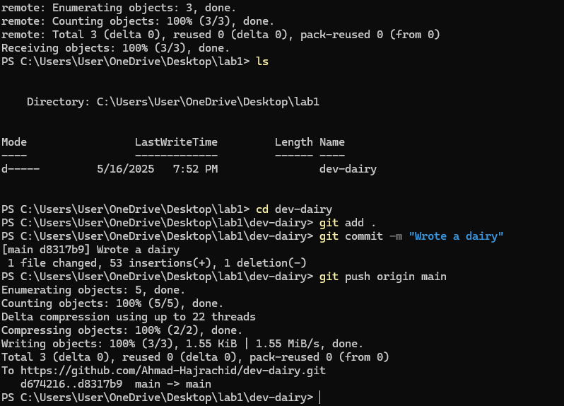

# dev-dairy

## My dev dairy

### Who am I?

> I'm Ahmad Haj Rashid, I have a Bachelor's degree in Computer Sceience from the Middle East University.

> I have a certification in Data Analytics from Google, but recently I've decided to career shift to web development, and fortunately I got the chance to attend ASAC's Full stack web development program!

## I've read an article called "Good Developer Mindset" and here are the lessons that I've learned

- **Learning is continuous** because tech evolves all the time.
- **When trying to solve big problems**, we should break them down to smaller and more managable problems.
- **We don't have to** write the best, cleanest code all the time. sometimes we can settle with the code as long as it's solving the issue at hands.
- **Always write a future-proof code** to make it easier to maintain and update.
- **Aim for simplicity and clarity** in the code.
- **Incorperate user feedback** while using iterative development process.
- **Prioritize effective communication** with the team members to solve issues, share knowledge using collaboration tools like git, issue trackers, and documentation.
- **Understand** how the tools and libraries work under the hood, and be the person who knows how things work, and how to fix them.
- **Automate** the repetitive tasks to save time and energy.

## What have I learned from the "Terminal Command Cheat Sheet"

- `pwd` – **Print Working Directory**  
  Shows the full path of your current location in the file system.
- `mkdir` - **Make Directory**
  Creates a new directory in the filesystem according to it's argument. If the file path is given, it'll be placed at the end. Otherwise, it will be created in the current working directory.
- `ls` – **List directory contents**  
  Lists all files and directories in the current location.
  - `ls -a` – Show **all** files including hidden ones (those starting with `.`).  
  - `ls -l` – Show files in **long format** (permissions, size, date).  
  - `ls -al` or `ls -la` – Combine both options for a full view including hidden files.

- `cd [directory]` – **Change Directory**  
  Moves you to a different directory. Examples:
  - `cd WhateverName` – Go to the WhateverName directory.  
  - `cd ..` – Go **up one directory level**.

- `clear` – **Clear the terminal screen**  
  Removes all previous output from the screen.

- `~` – **Home directory shortcut**  
  Can be used like `cd ~` to go to your home directory.

- `.` – **Current directory**

- `..` – **Parent directory (one level up)**

- `ls -R` – Recursively list all subdirectories and files.

- `ls [directory_name]` – View contents of a specific directory (not just the current one).

## The commands that I have used

